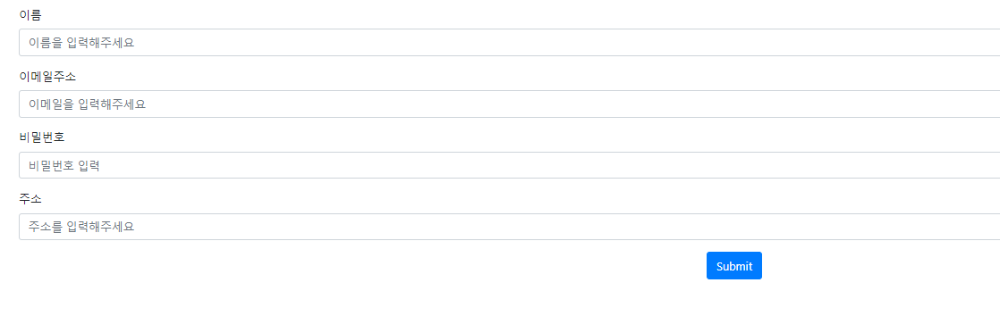
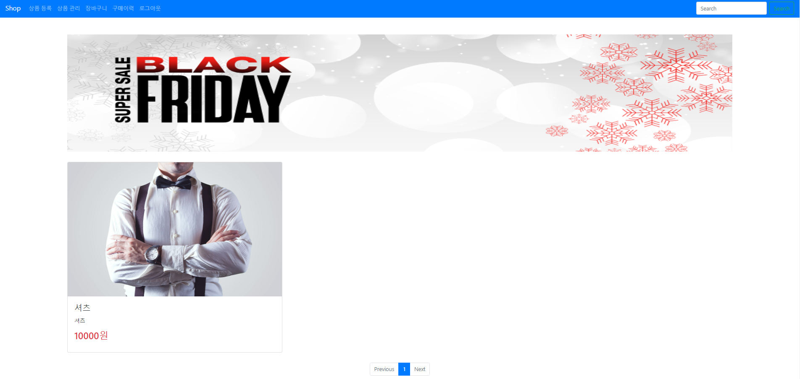
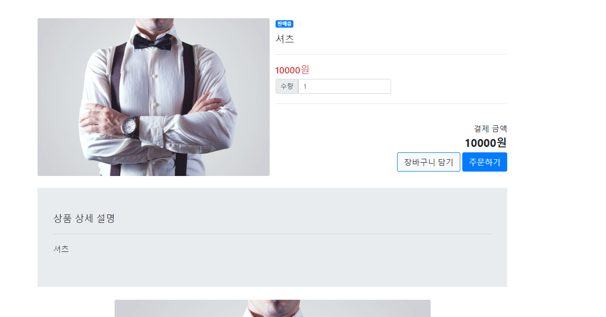
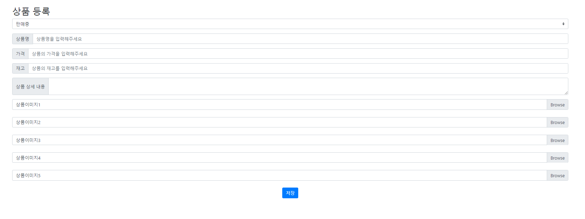
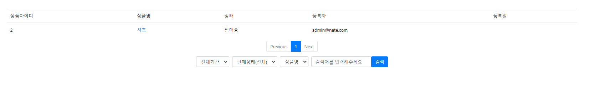
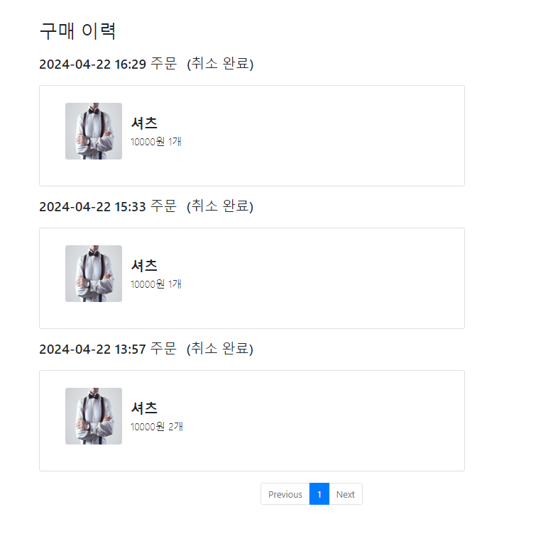

1. 기술툴  
-> SpringBoot 기반 프로젝트 생성 
-> Thymeleaf 사용하여 화면 생성 
-> Spring security 
   (회원가입, 로그인/로그아웃, 페이지 권한 설정) 
->JPA,QueryDSL,Lombok,Mysql
 
2. 기능 
-> 로그인, 로그 아웃 
-> 상품 등록,수정, 관리,상세페이지 
-> 주문 기능,이력, 취소 
-> 장바구니 담기, 조회, 상품 주문 
-> 파일 업로드 기능 
3.상세 화면     
   로그인 화면 
   

   회원가입 화면 
   
   메인 화면(어드민 계정) 
   -> 상품등록,상품관리,장바구니,구매이력,로그아웃
   
   메인 화면(user 계정) 
   -> 장바구니,구매이력,로그아웃
   
   상품 상세 화면 
   
   상품 등록 
   
   상품 관리 
   
   구매 이력 
   
